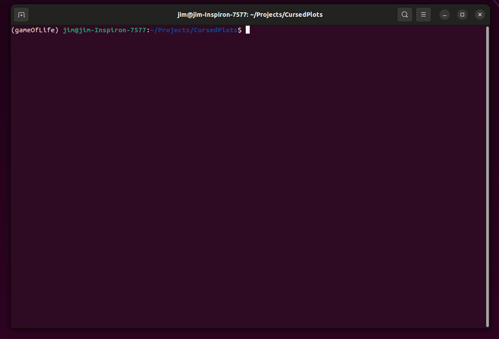

# CursedPlots

Using the [`curses`](https://docs.python.org/3/howto/curses.html) module ([docs](https://docs.python.org/3/library/curses.html)) to plot animations things on the terminal.Designed using `python 3.10`.

## ToDos

 - [ ] Add axis if max(data) * min(data) < 0
 - [ ] Each curve currently on distinct axis - allow common limits
 - [ ] Add legend
 - [ ] Add rich for tooltips and legend clicking to remove trace (as for plotly)
 - [ ] Use numba to speed up anti-aliasing
 - [ ] Allow np.NaNs to be intertrepted as missing data so as not to join points
 - [ ] Additional plot types:
     - [ ] Histogram
     - [ ] Scatter (simplified line)
 - [ ] Mutliple plots should work out of the box as each `screen` in curses is only aware of it's own bounds. Check this works
 - [ ] Visual testing using playwrgiht
 - [ ] Create examples directory
 - [x] Move _tranlate_to_grid method to base plot
 - [ ] anti_aliased.anti_alised... function gives quite thick lines - figure out a line width strategy. Perhaps simple increase the minimum weight displayed
 - [ ] poetry & make installable
